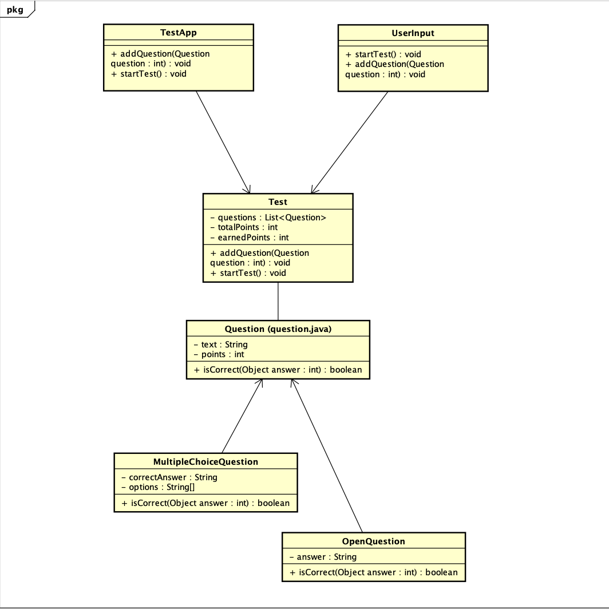

# Start Document
**Student Name:** `Nathan P. Pais D'costa`  
**Student Number:** `5045800`  
**Course:** `Java - The Next Step`  
**Assignment:** `End Assignment 4 - Digital Test` 
**Date:** `10-January-2024`

## Description:
To save the environment, NHL Stenden wants to digitalize their testing method.
The user should be able to add questions to a test. There are two types of questions: multiple choice and open 
questions. A multiple choice questions is worth one point, an open question three. When all the questions are added to 
the test, the test can be started. After completion of the test the score should be displayed. When the score is more 
than 55% the student passed the test. The end result is shown in the following way: Your score is: 56%. You PASSED!! 
If the result is insufficient the following appears on the screen: Your score is 54%. You FAILED!! The percentage that 
is printed is variable and is depending on the actual results.

## Input and Output:
In this section, the expected input and output of the application will be detailed.

### Input:
| Case                     | Type                                             | Conditions                                                                         |
|--------------------------|--------------------------------------------------|------------------------------------------------------------------------------------|
| Multiple Choice Question | String array (question, options, correct answer) | Question should not be empty;   Options and correct answer should be provided. |
| Open Question            | String (question, correct answer)                | Question and correct answer should not be empty.                                   |
| User Answer              | String                                           | Answer should be provided.                                                         |

### Output

| Case        | Type                       |
|-------------|----------------------------|
| Test Result | String (Pass/Fail message) |

### Calculations

| Case        | Calculation                                            |
|-------------|--------------------------------------------------------|
| Test Result | ($Total Score \over Maximum Possible Score$) $ * 100 $ |

### Remarks:
* Input validation will be implemented.
* Only the Main class will contain `System.out.println`.
* Unit Tests will be provided.

##  Class Diagram:

## Test Cases:

### Testcase 1: Testing the creation of a start document

| Step Description                              | Expected Result                                                             |
|-----------------------------------------------|-----------------------------------------------------------------------------|
| Create a new instance of the `TestApp` class. | N/A                                                                         |
| Call the `startTest()` method.                | Verify that an empty list of tests does not cause any errors or exceptions. |

### Testcase 2: Testing the creation of a multiple choice question

| Step Description                                                                                        | 	Expected Result                                                                                   |
|---------------------------------------------------------------------------------------------------------|----------------------------------------------------------------------------------------------------|
| Create a new instance of the `TestApp` class.                                                           | N/A                                                                                                |
| Create a new `MultipleChoiceQuestion` object with a question text, correct answer, options, and points. | N/A                                                                                                |
| Add the `MultipleChoiceQuestion` object to the `TestApp` object using the `addQuestion()` method.       | N/A                                                                                                |
| Call the `startTest()` method.                                                                          | Verify that the test starts correctly and the user is presented with the multiple choice question. |
| Enter the correct answer.                                                                               | Verify that the earned points are updated correctly.                                               |

### Testcase 3: Testing the creation of an open question

| Step Description                                                                        | 	Expected Result                                                                        |
|-----------------------------------------------------------------------------------------|-----------------------------------------------------------------------------------------|
| Create a new instance of the TestApp class.                                             | N/A                                                                                     |
| Create a new `OpenQuestion` object with a question text, correct answer, and points.    | N/A                                                                                     |
| Add the `OpenQuestion` object to the `TestApp` object using the `addQuestion()` method. | N/A                                                                                     |
| Call the `startTest()` method.                                                          | Verify that the test starts correctly and the user is presented with the open question. |
| Enter the correct answer.                                                               | Verify that the earned points are updated correctly.                                    |

## Conclusion:
his start document outlines the problem description, input and output specifications, calculations involved, class
diagram, and a comprehensive test plan with specific test cases for the digital test application. The provided test
cases cover various scenarios to ensure the correctness and reliability of the implemented code.

